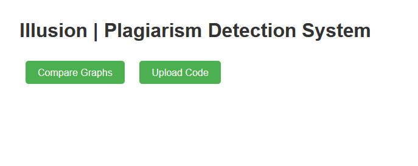
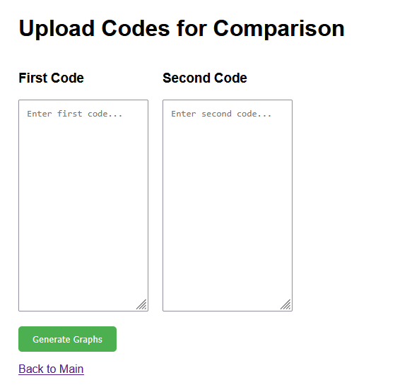
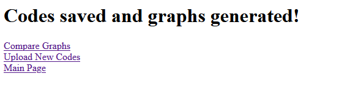
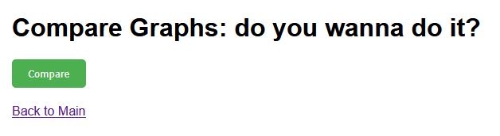
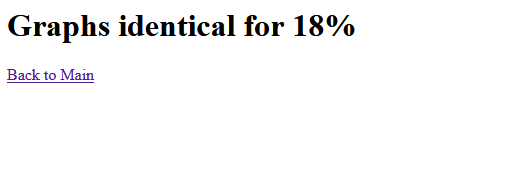

# Иллюзия

#### Мы вас всех забаним!

**Авторы**: `Сергеева И.` `Бадертдинов А.` `Гареева С.`

Для сборки и запуска проекта:
```
bash ./build_and_run_server.sh
```

Автоматически соберется и запустится сервер на "http://localhost:8080/"

На текущий момент сервер умеет принимать запросы двух типов: загрузить все решения для проверки и проверить загруженные:


Если перейти во вкладку загрузки кодов и выгрузить их, то программа запустит парсинг кодов и расположит обработанные .dot файлы в results. 


При выполнении возникнет ошибка => в терминал "клиента" будет выведено описание возникшей проблемы. Если все пройдет успешно Вы получите сообщение:


Далее вы можете проверить их на сходство при помощи Compare Graphs:


